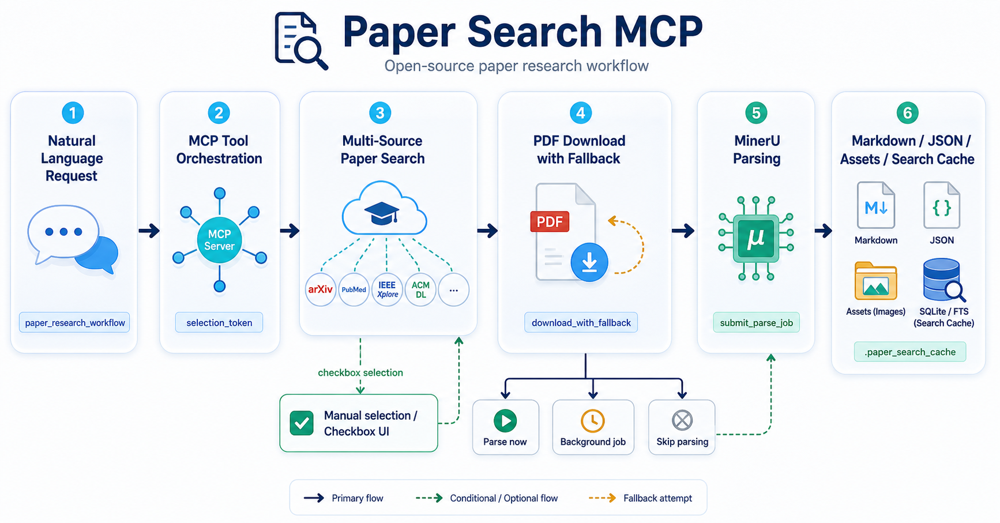
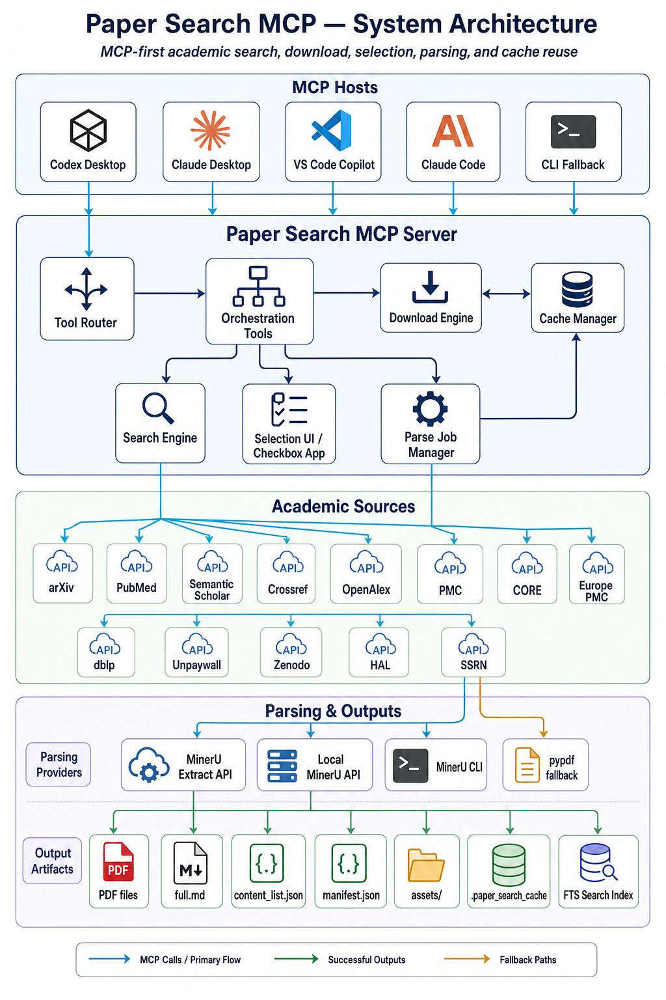
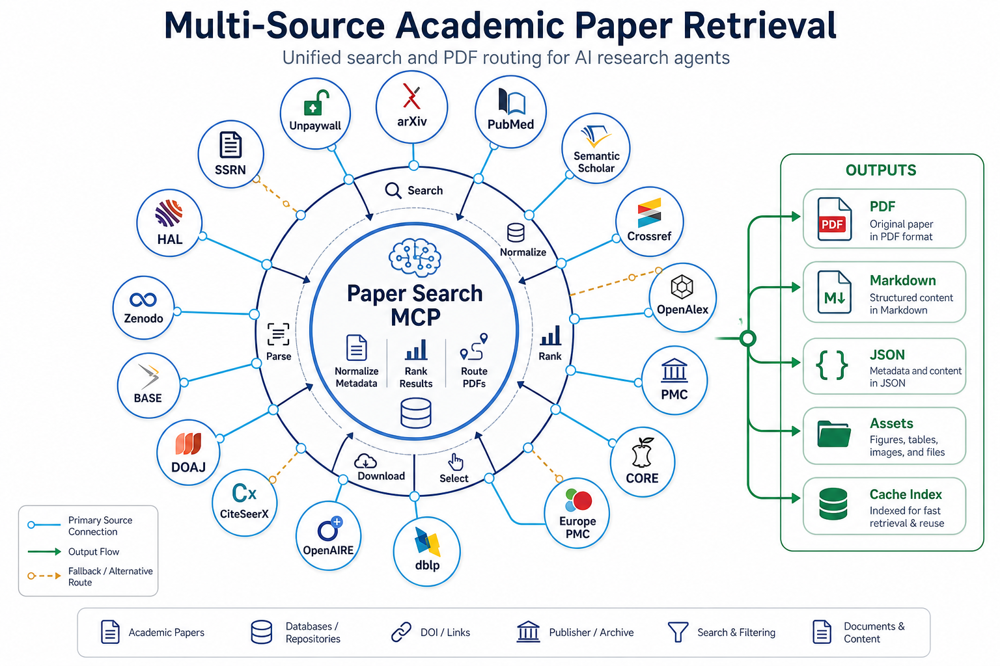
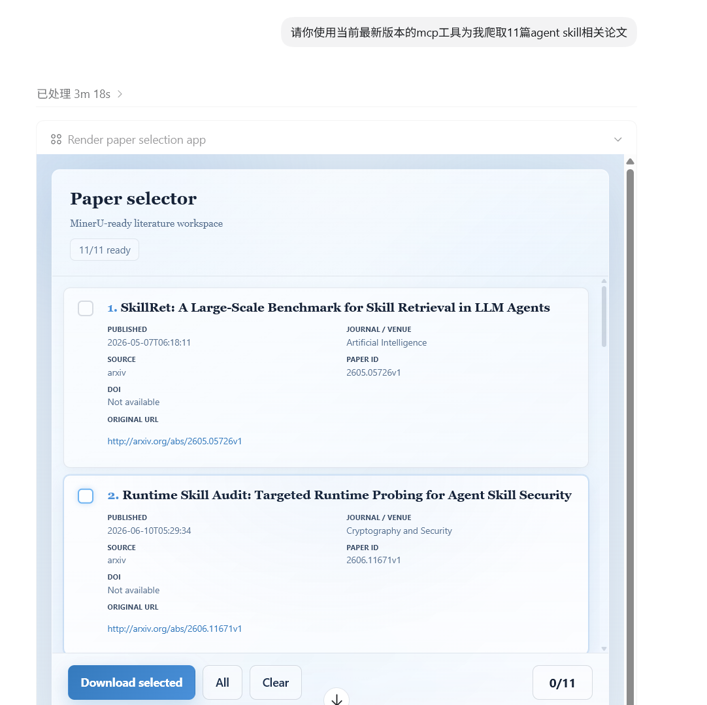
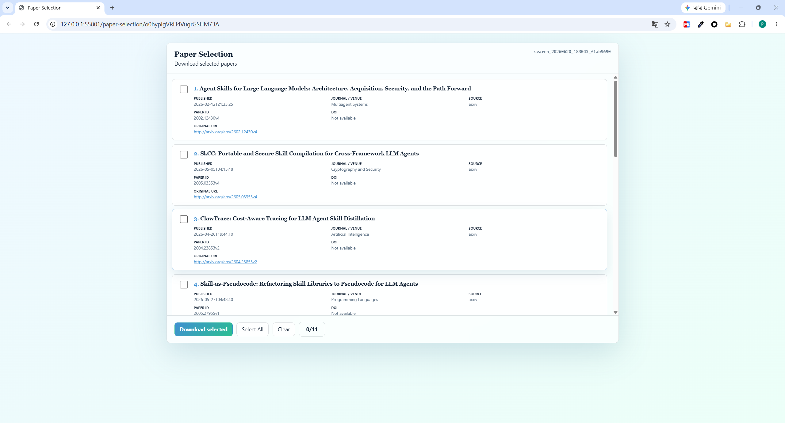

<h1 align="center"> Paper Search MCP</h1>

<p align="center">
  <b>🔬 A multi-source academic paper MCP server — search, download, and parse papers with AI agents</b>
</p>

<p align="center">
  <a href="https://pypi.org/project/paper-search-mcp/"></a>
  <a href="https://github.com/223nobody/paper-search-mcp/blob/main/LICENSE"></a>
  <a href="https://www.python.org/downloads/"></a>
  <a href="https://smithery.ai/server/@openags/paper-search-mcp"></a>
</p>

<p align="center">
  🌐 <a href="README.md">Chinese</a> | <a href="README_EN.md">English</a>
</p>

<p align="center">
  
</p>

---

## 🤖 One-Click AI Install

**Copy the prompt below into Claude Code or Codex, and the AI will install everything automatically:**

```text
Please install paper-search-mcp for me. This is a multi-source academic paper search/download/parse MCP server. Follow this workflow:

## 1. Clone the Repository
git clone https://github.com/223nobody/paper-search-mcp.git ~/code/paper-search-mcp
(Adjust to your preferred path: ~/code/paper-search-mcp on macOS/Linux, C:\code\paper-search-mcp on Windows)

## 2. Detect the Platform & Install Dependencies
- Check if uv (Python package manager) is installed; install it if needed.
- Enter the project directory and run `uv sync` to install dependencies.

## 3. Configure .env
- Copy .env.example to .env (if it doesn't exist).
- Guide me through filling in the required API keys:
  - MinerU API Key (important — enables high-quality PDF parsing; free registration at https://mineru.net)
  - Semantic Scholar API Key (optional — improves search rate limits)
  - CORE API Key (optional — download fallback)
- Leave the rest as defaults.

## 4. Register as Global MCP Server
Run the install script to register paper-search-mcp globally:
`python scripts/install-mcp-global.py`
This writes the MCP server config to `~/.claude/mcp.json`, so it works from any workspace without manual JSON editing.
(Use `--dry-run` to preview, `--force` to overwrite, or `--uninstall` to remove.)

## 5. Install the Skill (optional but recommended)
- Claude Code: Copy .claude/skills/paper-search/SKILL.md to ~/.claude/skills/paper-search/SKILL.md
- Codex: Copy .codex/skills/paper-search/SKILL.md to ~/.codex/skills/paper-search/SKILL.md

## 6. Verify Installation
- Run `uv run -m paper_search_mcp.server` to confirm the server starts successfully.
- Once you see the tool registration list, tell me installation is complete, list the core features available, and give me a few example prompts.
```

> 💡 **How it works**: The prompt above is an "install script" for AI agents. You don't need to manually run any of those steps — just paste it into Claude Code or Codex, and the AI will detect your platform, clone the code, configure the environment, write the correct MCP config files, and verify the installation.

---

## 📑 Table of Contents

- [🤖 One-Click AI Install](#-one-click-ai-install)
- [📖 Overview](#-overview)
- [🎯 Project Principles](#-project-principles)
- [✨ Features](#-features)
- [🧭 Visual Guide](#-visual-guide)
- [📊 Platform Capability Matrix](#-platform-capability-matrix)
- [🔑 Credential & API Key Requirements](#-credential--api-key-requirements)
- [📡 Data Source Configuration](#-data-source-configuration)
- [⚠️ Known Upstream Limitations](#️-known-upstream-limitations)
- [🔌 Optional Paid Platform Connectors](#-optional-paid-platform-connectors)
- [🆓 Free Source Expansion](#-free-source-expansion)
- [⚖️ Sci-Hub Notice](#️-sci-hub-notice)
- [📦 Installation](#-installation)
- [🧪 MinerU Parsing Workflow](#-mineru-parsing-workflow)
- [🏢 Publisher-Version Download (MCP Chaining)](#-publisher-version-download-mcp-chaining)
- [🤝 Contributing](#-contributing)
- [🎬 Demo](#-demo)
- [📋 TODO](#-todo)
- [📜 License](#-license)
- [🙏 Acknowledgements](#-acknowledgements)

---

## 📖 Overview

`paper-search-mcp` is a Python-based tool for searching and downloading academic papers from various platforms. It provides tools for searching papers, downloading PDFs, and extracting text, making it ideal for researchers and AI-driven workflows. It can be used as an MCP server (for Claude Desktop and other MCP clients) or as a Claude Code skill with a CLI interface.

---

## 🎯 Project Principles

- 🆓 **Free-First**: Public and open sources are the default roadmap. Paid or restricted sources are not the core direction of this project.
- 🔑 **Optional API Keys**: API keys are supported only when they improve stability, rate limits, or metadata quality. The MCP should still be usable without them whenever possible.
- 🤖 **LLM-Friendly Retrieval**: Search results should be standardized, deduplicated, and as complete as possible for downstream LLM workflows.
- 🔍 **Source Transparency**: Different sources have different strengths. The MCP should make those tradeoffs explicit instead of pretending every source supports full-text retrieval.

---

## ✨ Features

- 🏗️ **Two-Layer Architecture**:
  - **Layer 1 (Unified Tooling)**: High-level `search_papers` for multi-source concurrent search & deduplication, and `download_with_fallback` relying on publisher open access links with sequential fallbacks.
  - **Layer 2 (Platform Connectors)**: Modular connectors for specific academic platforms (arXiv, PubMed, bioRxiv, Semantic Scholar, etc.) equipped with intelligent DOI extraction via regex text analysis or API fields.
- 🌐 **Multi-Source Support**: Search and download papers from arXiv, PubMed, bioRxiv, medRxiv, Google Scholar, IACR ePrint Archive, Semantic Scholar, Crossref, OpenAlex, PubMed Central (PMC), CORE, Europe PMC, dblp, OpenAIRE, CiteSeerX, DOAJ, BASE, Zenodo, HAL, SSRN, Unpaywall (DOI lookup), and optional Sci-Hub workflows.
- 📋 **Standardized Output**: Papers are returned in a consistent dictionary format via the `Paper` class.
- 🆓 **Free-First Design**: Open and public sources are prioritized before any optional commercial or restricted integrations.
- 🔑 **Optional API-Key Enhancement**: Sources like Semantic Scholar can work better with a user-provided API key, but are not intended to force paid usage.
- 📖 **Discovery + Retrieval Workflow**: Google Scholar and Crossref can be used for discovery and DOI backfilling, while open repositories and publisher links are used for lawful full-text resolution where available.
- 📂 **OA-First Fallback Chain**: `download_with_fallback` now follows source-native download → OpenAIRE/CORE/Europe PMC/PMC discovery → Unpaywall DOI resolution → optional Sci-Hub. Sci-Hub fallback is opt-in.
- 🧪 **MinerU-First Parsing Pipeline**: Local PDFs can be parsed into `full.md`, `content_list.json`, `manifest.json`, and extracted assets beside the source PDF. With `PAPER_SEARCH_MCP_MINERU_API_KEY` configured, `extract`/`cloud_api` mode can submit multiple PDFs through one MinerU batch; `auto` still falls back through local API/CLI and `pypdf`.
- ⚡ **Saved-PDF Parsing Prompts + Selection UI**: Download/read tools auto-submit a background MinerU job for saved-PDF sets of 10 or fewer. Batches over 10 PDFs surface the MCP Apps checkbox selector before download; after explicit selection, download-and-parse flows call `download_and_parse_selected_papers`.
- 🔎 **Fast Parsed-Paper Search**: Parsed blocks are indexed into `.paper_search_cache/parsed_index.sqlite3` with SQLite FTS when available, while file-based search remains the fallback.
- 🕐 **Background Parsing Jobs**: Long selected-paper parses can be submitted with `submit_parse_job`, then tracked with `get_parse_job_status`, `list_parse_jobs`, and `cancel_parse_job`.
- 🔌 **MCP Integration**: Compatible with MCP clients for LLM context enhancement.
- 🏢 **Publisher-Version Download (MCP Chaining)**: Built-in scansci-pdf MCP Chaining integration upgrades cached arXiv papers to publisher final versions (Nature, Elsevier, Springer, etc.). Auto-install, zero-config, on-demand — all existing features remain unaffected.
- 🧩 **Extensible Design**: Easily add new academic platforms by extending the `academic_platforms` module.

---

## 🧭 Visual Guide

### System Architecture

<p align="center">
  
</p>

### Multi-Source Retrieval Network

<p align="center">
  
</p>

---

## 📊 Platform Capability Matrix

This matrix reflects **verified live-integration results** from functional and end-to-end regression tests in this repository. Columns show the highest capability level observed under normal conditions.

| Platform           | Search           | Download              | Read                  | Notes                                                                                                        |
| ------------------ | ---------------- | --------------------- | --------------------- | ------------------------------------------------------------------------------------------------------------ |
| arXiv              | ✅               | ✅                    | ✅                    | Open API; reliable                                                                                           |
| PubMed             | ✅               | ❌                    | ⚠️ info-only          | Open API; reliable                                                                                           |
| bioRxiv            | ✅               | ✅                    | ✅                    | Open API; reliable                                                                                           |
| medRxiv            | ✅               | ✅                    | ✅                    | Open API; reliable                                                                                           |
| Google Scholar     | ⚠️               | ❌                    | ❌                    | Bot-detection active; set `PAPER_SEARCH_MCP_GOOGLE_SCHOLAR_PROXY_URL`                                        |
| IACR               | ✅               | ✅                    | ✅                    | Open API; reliable                                                                                           |
| Semantic Scholar   | ✅               | ✅ (OA)               | ✅ (OA)               | Works without key (rate-limited); key improves limits; key rejection (403) retried automatically without key |
| Crossref           | ✅               | ❌                    | ⚠️ info-only          | Open API; reliable                                                                                           |
| OpenAlex           | ✅               | ❌                    | ⚠️ info-only          | Open API; reliable                                                                                           |
| PMC                | ✅               | ✅ (OA only)          | ✅ (OA only)          | OA PDFs only; direct download may be blocked by some proxy environments                                      |
| CORE               | ✅               | ✅ (record-dependent) | ✅ (record-dependent) | Free key recommended; connector retries with backoff and falls back to key-less on 401/403                   |
| Europe PMC         | ✅               | ✅ (OA)               | ✅ (OA)               | OA PDFs only; direct download may be blocked by some proxy environments                                      |
| dblp               | ✅               | ❌                    | ⚠️ info-only          | Open API; reliable                                                                                           |
| OpenAIRE           | ✅               | ❌                    | ❌                    | Open API; retries 3× with escalating request profiles on transient 403                                       |
| CiteSeerX          | ⚠️               | ✅ (record-dependent) | ⚠️                    | API endpoint intermittently unavailable / redirects to web archive                                           |
| DOAJ               | ✅               | ⚠️ (URL-dependent)    | ⚠️ (URL-dependent)    | PDF availability varies by article; free key raises rate limits                                              |
| BASE               | ⚠️               | ✅ (record-dependent) | ✅ (record-dependent) | OAI-PMH endpoint requires institutional IP registration; returns empty gracefully otherwise                  |
| Zenodo             | ✅               | ✅ (record-dependent) | ✅ (record-dependent) | Open API; reliable                                                                                           |
| HAL                | ✅               | ✅ (record-dependent) | ✅ (record-dependent) | Open API; reliable                                                                                           |
| SSRN               | ⚠️               | ⚠️ best-effort        | ⚠️ best-effort        | 403 bot-detection active; public PDF only                                                                    |
| Unpaywall          | ✅ (DOI lookup)  | ❌                    | ❌                    | **Requires** `PAPER_SEARCH_MCP_UNPAYWALL_EMAIL`                                                              |
| Sci-Hub (optional) | ⚠️ fallback-only | ✅                    | ❌                    | Optional; unstable mirrors; user responsibility                                                              |
| **IEEE Xplore** 🔑 | 🚧 skeleton      | 🚧 skeleton           | 🚧 skeleton           | Requires `PAPER_SEARCH_MCP_IEEE_API_KEY` to activate                                                         |
| **ACM DL** 🔑      | 🚧 skeleton      | 🚧 skeleton           | 🚧 skeleton           | Requires `PAPER_SEARCH_MCP_ACM_API_KEY` to activate                                                          |

> ✅ = reliable in live tests. ⚠️ = works but subject to upstream instability or access restrictions. ❌ = not supported. 🔑 = key required. 🚧 = skeleton only.

---

## 🔑 Credential & API Key Requirements

All keys are **optional** unless noted. Configure them in `.env` (preferred) or as shell exports.

| Environment Variable                        | Provider         | Required?                               | How to obtain                                                                                          |
| ------------------------------------------- | ---------------- | --------------------------------------- | ------------------------------------------------------------------------------------------------------ |
| `PAPER_SEARCH_MCP_UNPAYWALL_EMAIL`          | Unpaywall        | **Yes** (Unpaywall disabled without it) | Any valid email; register at [unpaywall.org](https://unpaywall.org/products/api)                       |
| `PAPER_SEARCH_MCP_CORE_API_KEY`             | CORE             | Recommended                             | Free at [core.ac.uk/services/api](https://core.ac.uk/services/api)                                     |
| `PAPER_SEARCH_MCP_SEMANTIC_SCHOLAR_API_KEY` | Semantic Scholar | Optional                                | Free at [semanticscholar.org](https://www.semanticscholar.org/product/api) — improves rate limits      |
| `PAPER_SEARCH_MCP_GOOGLE_SCHOLAR_PROXY_URL` | Google Scholar   | Optional                                | Your HTTP/HTTPS proxy URL — bypasses bot-detection                                                     |
| `PAPER_SEARCH_MCP_DOAJ_API_KEY`             | DOAJ             | Optional                                | Free at [doaj.org](https://doaj.org/apply-for-api-key/) — raises hourly rate limit                     |
| `PAPER_SEARCH_MCP_ZENODO_ACCESS_TOKEN`      | Zenodo           | Optional                                | Free at [zenodo.org](https://zenodo.org/account/settings/applications/) — required for private records |
| `PAPER_SEARCH_MCP_IEEE_API_KEY`             | IEEE Xplore      | **Required to activate**                | Free at [developer.ieee.org](https://developer.ieee.org/)                                              |
| `PAPER_SEARCH_MCP_ACM_API_KEY`              | ACM DL           | **Required to activate**                | See [libraries.acm.org/digital-library/acm-open](https://libraries.acm.org/digital-library/acm-open)   |

> 📌 All variables follow the `PAPER_SEARCH_MCP_<NAME>` prefix scheme. Legacy names without the prefix (e.g. `CORE_API_KEY`, `UNPAYWALL_EMAIL`) are still supported for backward compatibility.

---

## 📡 Data Source Configuration

`PAPER_SEARCH_MCP_DISABLED_SOURCES` controls which sources are skipped during search. Based on `diagnose_paper_sources` testing:

### ✅ Sources with Direct PDF Download

| Source    | Domain                 | Download                           |
| --------- | ---------------------- | ---------------------------------- |
| **arxiv** | CS / General           | ✅ **Only reliable CS PDF source** |
| pmc       | Biomedical OA          | ✅ Biomedical only                 |
| biorxiv   | Biology preprints      | ✅ Biology only                    |
| medrxiv   | Medical preprints      | ✅ Medical only                    |
| iacr      | Cryptography preprints | ✅ Crypto only                     |

### 📋 Metadata Only (No PDF Download)

crossref, openalex, dblp, google_scholar, unpaywall — these provide discovery/DOI metadata but do **not** host PDFs.

### ⚠️ Unstable Download (Record-Dependent)

semantic, core, citeseerx, doaj, base, zenodo, hal, openaire — PDF availability varies by record; CS coverage is low.

### 🎯 Arxiv-Only Config (Recommended for CS)

For computer science papers, disable all other sources to avoid returning undownloadable metadata-only results:

```dotenv
# .env — arxiv only; all other sources disabled
PAPER_SEARCH_MCP_DISABLED_SOURCES=pubmed,biorxiv,medrxiv,google_scholar,iacr,semantic,crossref,openalex,pmc,core,europepmc,dblp,openaire,citeseerx,doaj,base,zenodo,hal,ssrn,unpaywall
```

Comment out or clear this line to restore multi-source search. See `paper_search_mcp/engine/search.py` → `ALL_SOURCES` for the full source list.

---

## ⚠️ Known Upstream Limitations

Some search failures are caused by external provider instability, not by bugs in this project:

| Source           | Symptom                        | Cause                                                   | Workaround                                                                                                                        |
| ---------------- | ------------------------------ | ------------------------------------------------------- | --------------------------------------------------------------------------------------------------------------------------------- |
| Google Scholar   | Returns 0 results / empty HTML | Bot-detection (CAPTCHA)                                 | Set `PAPER_SEARCH_MCP_GOOGLE_SCHOLAR_PROXY_URL` to a proxy                                                                        |
| Semantic Scholar | 429 rate-limited responses     | Anonymous access rate limit                             | Set `PAPER_SEARCH_MCP_SEMANTIC_SCHOLAR_API_KEY`; if key is rejected (403) connector automatically retries without key             |
| CORE             | 500 / timeout errors           | Unauthenticated rate limiting                           | Set `PAPER_SEARCH_MCP_CORE_API_KEY` (free); connector retries with exponential backoff and falls back to key-less on 401/403      |
| OpenAIRE         | Transient 403 responses        | IP-based session rate limiting                          | Connector retries 3× per profile, escalating: plain session → XML Accept header → raw `requests.get` with Mozilla UA              |
| CiteSeerX        | 404 via web archive redirect   | PSU endpoint intermittently redirects to archive        | No workaround; connector returns empty gracefully                                                                                 |
| BASE             | Search returns 0 results       | OAI-PMH endpoint requires institutional IP registration | Register at [base-search.net](https://www.base-search.net/about/en/) for API access; connector returns empty gracefully otherwise |
| SSRN             | HTTP 403                       | Bot-detection (Cloudflare)                              | No workaround; connector tries two endpoints and returns a clear message on failure                                               |
| PMC / Europe PMC | PDF download ProxyError        | Local proxy blocking direct HTTPS PDF download          | Disable proxy or use `download_with_fallback` instead                                                                             |
| Unpaywall        | Skipped entirely               | `UNPAYWALL_EMAIL` env var not set                       | Set `PAPER_SEARCH_MCP_UNPAYWALL_EMAIL` in `.env`                                                                                  |

---

## 🔌 Optional Paid Platform Connectors (Phase 3)

IEEE Xplore and ACM Digital Library connectors are included as **opt-in skeletons**.
They are **disabled by default** — no API calls are made unless you explicitly configure the corresponding keys.

| Platform            | Env Var                         | Status                                                                     |
| ------------------- | ------------------------------- | -------------------------------------------------------------------------- |
| IEEE Xplore         | `PAPER_SEARCH_MCP_IEEE_API_KEY` | 🚧 skeleton — search registered, download/read raise `NotImplementedError` |
| ACM Digital Library | `PAPER_SEARCH_MCP_ACM_API_KEY`  | 🚧 skeleton — search registered, download/read raise `NotImplementedError` |

**How to enable:**

```bash
export PAPER_SEARCH_MCP_IEEE_API_KEY=<your_ieee_key>       # free key at https://developer.ieee.org/
export PAPER_SEARCH_MCP_ACM_API_KEY=<your_acm_key>         # see https://libraries.acm.org/digital-library
```

Once a key is set, the corresponding source is automatically added to `ALL_SOURCES` and its MCP tools (`search_ieee` / `search_acm`, `download_ieee` / `download_acm`, `read_ieee_paper` / `read_acm_paper`) are registered at server startup.

Without a key the connectors log a startup warning only — the rest of the server is unaffected.

---

## 🆓 Free Source Expansion (Phase 4)

Additional free-source connectors: 🟢 `zenodo` (search + PDF), 🟢 `hal` (search + PDF), 🟢 `ssrn` (discovery + best-effort PDF from public links), 🟢 `unpaywall` (DOI lookup + OA URL resolution). SSRN is compliance-first: only direct public PDF links; returns clear message for restricted content.

---

## ⚖️ Sci-Hub Notice

Sci-Hub is available as an optional, opt-in connector — not the default full-text path. Availability is unstable, legal risks vary by jurisdiction, and users are responsible for enabling it. Open-access sources should always be tried first.

---

## 📦 Installation

Choose the method that best fits your workflow. All methods support the same [optional API keys](#-credential--api-key-requirements).

---

### 🎯 Claude Code (Skill) — MCP-first guidance for Claude Code users

Install the skill when you want Claude Code to recognize paper-search requests
automatically. The skill is MCP-first: when `paper-search-mcp` MCP tools are
available, it tells the agent to call `paper_research_workflow` and related MCP
tools instead of opening a terminal.

**Prerequisites**: [uv](https://docs.astral.sh/uv/getting-started/installation/) and [Claude Code](https://docs.anthropic.com/en/docs/claude-code/overview).

**Step 1 — Clone the repo:**

```bash
git clone https://github.com/223nobody/paper-search-mcp.git ~/paper-search-mcp
```

**Step 2 — Install the skill:**

```bash
mkdir -p ~/.claude/skills/paper-search
cp ~/paper-search-mcp/claude-code/SKILL.md ~/.claude/skills/paper-search/SKILL.md
```

**Step 3 — Confirm MCP-first behavior:**

The included `claude-code/SKILL.md` instructs the agent to use MCP tools first.
CLI examples are retained only as a fallback if MCP tools are unavailable or the
user explicitly requests terminal commands.

**Step 4 (optional) — Configure API keys:**

Create a `.env` file in the repo root for optional API keys (see [Environment Variables](#environment-variables-env-file)).

**That's it.** Next time you start Claude Code, just ask it to find papers. For example:

- "Find me recent papers on CRISPR base editing"
- "Search arxiv and semantic scholar for transformer attention mechanisms"
- "Download the PDF for arxiv paper 2106.12345"

When MCP is available, the default natural-language path is
`paper_research_workflow`. The `paper-search` CLI is a fallback only.

---

> 📂 **MCP Server Config file locations** (for methods below)
>
> - **macOS**: `~/Library/Application Support/Claude/claude_desktop_config.json`
> - **Windows**: `%APPDATA%\Claude\claude_desktop_config.json`
> - **Linux**: `~/.config/Claude/claude_desktop_config.json`

---

### Method 1 — Smithery 🚀 (one-command, recommended for Claude Desktop)

```bash
npx -y @smithery/cli install @openags/paper-search-mcp --client claude
```

Smithery automatically writes the correct config block for you. No manual JSON editing needed.

---

### Method 2 — `uvx` 📦 (no install, always latest)

`uvx` runs the package directly from PyPI without a permanent install. Requires [uv](https://docs.astral.sh/uv/getting-started/installation/).

```bash
# Install uv (skip if already installed)
curl -LsSf https://astral.sh/uv/install.sh | sh
```

> ⚠️ **macOS note**: `uvx` generated wrapper scripts rely on `realpath`, which is not included in macOS by default. If you see a `realpath: command not found` error, either install GNU coreutils (`brew install coreutils`) or use **Method 3 (`uv run`)** instead — it does not have this limitation.

**Claude Desktop config:**

```json
{
  "mcpServers": {
    "paper-search-mcp": {
      "command": "uvx",
      "args": ["paper-search-mcp"],
      "env": { "PAPER_SEARCH_MCP_UNPAYWALL_EMAIL": "your@email.com", "PAPER_SEARCH_MCP_CORE_API_KEY": "", "PAPER_SEARCH_MCP_SEMANTIC_SCHOLAR_API_KEY": "", "PAPER_SEARCH_MCP_ZENODO_ACCESS_TOKEN": "", "PAPER_SEARCH_MCP_GOOGLE_SCHOLAR_PROXY_URL": "", "PAPER_SEARCH_MCP_IEEE_API_KEY": "", "PAPER_SEARCH_MCP_ACM_API_KEY": "" }
    }
  }
}
```

---

### Method 3 — `uv` 💾 (persistent install)

```bash
uv tool install paper-search-mcp
```

**Claude Desktop config:**

```json
{
  "mcpServers": {
    "paper-search-mcp": {
      "command": "uv",
      "args": ["tool", "run", "paper-search-mcp"],
      "env": { "PAPER_SEARCH_MCP_UNPAYWALL_EMAIL": "your@email.com", "PAPER_SEARCH_MCP_CORE_API_KEY": "", "PAPER_SEARCH_MCP_SEMANTIC_SCHOLAR_API_KEY": "", "PAPER_SEARCH_MCP_ZENODO_ACCESS_TOKEN": "", "PAPER_SEARCH_MCP_GOOGLE_SCHOLAR_PROXY_URL": "", "PAPER_SEARCH_MCP_IEEE_API_KEY": "", "PAPER_SEARCH_MCP_ACM_API_KEY": "" }
    }
  }
}
```

---

### Method 4 — `pip` 🐍 (standard Python install)

```bash
pip install paper-search-mcp
```

**Claude Desktop config:**

```json
{
  "mcpServers": {
    "paper-search-mcp": {
      "command": "python",
      "args": ["-m", "paper_search_mcp.server"],
      "env": { "PAPER_SEARCH_MCP_UNPAYWALL_EMAIL": "your@email.com", "PAPER_SEARCH_MCP_CORE_API_KEY": "", "PAPER_SEARCH_MCP_SEMANTIC_SCHOLAR_API_KEY": "", "PAPER_SEARCH_MCP_ZENODO_ACCESS_TOKEN": "", "PAPER_SEARCH_MCP_GOOGLE_SCHOLAR_PROXY_URL": "", "PAPER_SEARCH_MCP_IEEE_API_KEY": "", "PAPER_SEARCH_MCP_ACM_API_KEY": "" }
    }
  }
}
```

> If `python` is not on your PATH, replace it with the full path (e.g. `/usr/bin/python3` or `C:\Python311\python.exe`). Run `which python3` / `where python` to find it.

---

### Method 5 — `npx` 📡 (via Smithery CLI, no local Python needed)

```bash
npx -y @smithery/cli run @openags/paper-search-mcp
```

**Claude Desktop config:**

```json
{
  "mcpServers": {
    "paper-search-mcp": {
      "command": "npx",
      "args": ["-y", "@smithery/cli", "run", "@openags/paper-search-mcp"],
      "env": {
        "PAPER_SEARCH_MCP_UNPAYWALL_EMAIL": "your@email.com",
        "PAPER_SEARCH_MCP_CORE_API_KEY": "",
        "PAPER_SEARCH_MCP_SEMANTIC_SCHOLAR_API_KEY": ""
      }
    }
  }
}
```

---

### Method 6 — Docker 🐳

```bash
docker build -t paper-search-mcp .
docker run --rm -i \
  -e PAPER_SEARCH_MCP_UNPAYWALL_EMAIL=your@email.com \
  -e PAPER_SEARCH_MCP_CORE_API_KEY=your_core_key \
  paper-search-mcp
```

**Claude Desktop config:**

```json
{
  "mcpServers": {
    "paper-search-mcp": {
      "command": "docker",
      "args": ["run", "--rm", "-i", "paper-search-mcp"],
      "env": { "PAPER_SEARCH_MCP_UNPAYWALL_EMAIL": "your@email.com", "PAPER_SEARCH_MCP_CORE_API_KEY": "", "PAPER_SEARCH_MCP_SEMANTIC_SCHOLAR_API_KEY": "", "PAPER_SEARCH_MCP_ZENODO_ACCESS_TOKEN": "", "PAPER_SEARCH_MCP_GOOGLE_SCHOLAR_PROXY_URL": "", "PAPER_SEARCH_MCP_IEEE_API_KEY": "", "PAPER_SEARCH_MCP_ACM_API_KEY": "" }
    }
  }
}
```

---

### Method 7 — Clone & run from source 🛠️ (development / recommended for macOS local)

This is the most reliable method on macOS — no wrapper scripts, no `realpath` issues.

```bash
# 1. Install uv (skip if already installed)
curl -LsSf https://astral.sh/uv/install.sh | sh

# 2. Clone repo
git clone https://github.com/223nobody/paper-search-mcp.git
cd paper-search-mcp

# 3. Verify it runs (uv auto-resolves dependencies, no manual install needed)
uv run -m paper_search_mcp.server
```

**Claude Desktop config** (replace the directory path with your actual clone location):

```json
{
  "mcpServers": {
    "paper-search-mcp": {
      "command": "uv",
      "args": [
        "run",
        "--directory",
        "/path/to/paper-search-mcp",
        "-m",
        "paper_search_mcp.server"
      ],
      "env": { "PAPER_SEARCH_MCP_UNPAYWALL_EMAIL": "your@email.com", "PAPER_SEARCH_MCP_CORE_API_KEY": "", "PAPER_SEARCH_MCP_SEMANTIC_SCHOLAR_API_KEY": "", "PAPER_SEARCH_MCP_ZENODO_ACCESS_TOKEN": "", "PAPER_SEARCH_MCP_GOOGLE_SCHOLAR_PROXY_URL": "", "PAPER_SEARCH_MCP_IEEE_API_KEY": "", "PAPER_SEARCH_MCP_ACM_API_KEY": "" }
    }
  }
}
```

For example, if you cloned to `/Users/mac/Pengsong/paper-search-mcp`:

```json
"args": ["run", "--directory", "/Users/mac/Pengsong/paper-search-mcp", "-m", "paper_search_mcp.server"]
```

> `uv run` automatically installs dependencies into an isolated environment on first run — no `pip install` or `venv` needed.

For active development, optionally install an editable copy:

```bash
uv venv && source .venv/bin/activate   # Windows: .venv\Scripts\activate
uv pip install -e ".[dev]"
```

---

### 🔧 Environment Variables (`.env` file)

Instead of putting keys directly in the JSON config you can store them in a `.env` file in the project root (auto-loaded on startup):

```bash
cp .env.example .env   # if running from source
# or create ~/.paper-search-mcp.env for global use
```

```dotenv
PAPER_SEARCH_MCP_UNPAYWALL_EMAIL=your@email.com
PAPER_SEARCH_MCP_CORE_API_KEY=
PAPER_SEARCH_MCP_SEMANTIC_SCHOLAR_API_KEY=
PAPER_SEARCH_MCP_ZENODO_ACCESS_TOKEN=
PAPER_SEARCH_MCP_GOOGLE_SCHOLAR_PROXY_URL=
PAPER_SEARCH_MCP_IEEE_API_KEY=
PAPER_SEARCH_MCP_ACM_API_KEY=
```

To use a custom path: `export PAPER_SEARCH_MCP_ENV_FILE=/absolute/path/to/.env`

> 📌 Legacy variable names without the `PAPER_SEARCH_MCP_` prefix (e.g. `CORE_API_KEY`, `UNPAYWALL_EMAIL`) are still supported for backward compatibility.

MinerU key setup: `mineru_setup_status` checks key config. When missing/expired, results include `mineru_api_key_prompt`. MCP Apps clients render `render_mineru_api_key_setup_app` (`ui://paper-search/mineru-api-key.html`) which saves keys via `configure_mineru_api_key` into `.env`. The MinerU key and paper-selection widgets share the same liquid-glass style.

MinerU extract uploads use Aliyun OSS signed URLs. To avoid local/system proxy TLS interruptions during those uploads, the parser adds `.aliyuncs.com` and `mineru.oss-cn-shanghai.aliyuncs.com` to `NO_PROXY` / `no_proxy` in the current process by default. Existing entries are preserved.

```dotenv
# Disable the automatic OSS proxy bypass if your network requires OSS through a proxy.
PAPER_SEARCH_MCP_MINERU_OSS_NO_PROXY=false

# Override the default bypass hosts.
PAPER_SEARCH_MCP_MINERU_OSS_NO_PROXY_HOSTS=.aliyuncs.com,mineru.oss-cn-shanghai.aliyuncs.com
```

---

## 🧪 MinerU Parsing Workflow

The project now separates discovery/download from parsing. A typical agent workflow is:

1. 🔍 Use `search_papers` or `paper-search search` to discover candidate papers.
2. 📥 Use source-native download or `download_with_fallback` to obtain a PDF.
3. 🧠 Parse the PDF with MinerU. This writes parsed artifacts beside the PDF
   (`example_mineru/full.md`, `content_list.json`, `manifest.json`, `assets/`).
   The project cache keeps only lightweight metadata and indexes, not a
   duplicate PDF or duplicate parsed content:

```bash
paper-search parse ~/Desktop/example.pdf --paper-key example --mode auto
paper-search parse-batch ~/Desktop/a.pdf ~/Desktop/b.pdf --mode extract
```

4. 📖 Reuse parsed artifacts by paper key. The cache commands resolve back to the
   PDF-side `*_mineru` directory when it exists:

```bash
paper-search cache list
paper-search cache get example -f markdown
paper-search cache search example "attention"
paper-search cache search-index "attention" --paper-key example
paper-search cache rebuild-index
paper-search cache assets example
paper-search cache cleanup-stale
```

Parser configuration:

```dotenv
PAPER_SEARCH_MCP_CACHE_DIR=.paper_search_cache
PAPER_SEARCH_MCP_SEARCH_PROFILE=fast
PAPER_SEARCH_MCP_SEARCH_TIMEOUT_SECONDS=18
PAPER_SEARCH_MCP_SEARCH_SOURCE_TIMEOUT_SECONDS=12
PAPER_SEARCH_MCP_SEARCH_CACHE_TTL_SECONDS=300
PAPER_SEARCH_MCP_ARXIV_TIMEOUT_SECONDS=8
PAPER_SEARCH_MCP_ARXIV_MAX_ATTEMPTS=2
PAPER_SEARCH_MCP_DOWNLOAD_TIMEOUT_SECONDS=20
PAPER_SEARCH_MCP_PARSE_CONCURRENCY=3
PAPER_SEARCH_MCP_PARSE_PROMPT_TIMEOUT_SECONDS=180
PAPER_SEARCH_MCP_PARSE_PROMPT_TIMEOUT_PER_PAPER_SECONDS=15
PAPER_SEARCH_MCP_PARSE_PROMPT_TIMEOUT_ACTION=no_parse
PAPER_SEARCH_MCP_PARSE_PROMPT_ALLOW_REOPEN=false
PAPER_SEARCH_MCP_MINERU_MODE=auto
PAPER_SEARCH_MCP_MINERU_BASE_URL=http://127.0.0.1:8000
PAPER_SEARCH_MCP_MINERU_BACKEND=pipeline
PAPER_SEARCH_MCP_MINERU_API_KEY=
PAPER_SEARCH_MCP_MINERU_EXTRACT_BASE_URL=https://mineru.net/api/v4
PAPER_SEARCH_MCP_MINERU_MODEL_VERSION=vlm
PAPER_SEARCH_MCP_MINERU_LANGUAGE=ch
PAPER_SEARCH_MCP_MINERU_IS_OCR=false
PAPER_SEARCH_MCP_MINERU_ENABLE_FORMULA=true
PAPER_SEARCH_MCP_MINERU_ENABLE_TABLE=true
PAPER_SEARCH_MCP_MINERU_AUTO_ORDER=extract,local_api,cli,pypdf
PAPER_SEARCH_MCP_MINERU_BATCH_PARSE=false
PAPER_SEARCH_MCP_MINERU_UPLOAD_CONCURRENCY=4
PAPER_SEARCH_MCP_MINERU_DOWNLOAD_CONCURRENCY=4
PAPER_SEARCH_MCP_MINERU_EXPORT_ZIP=false
```

Set `MINERU_MODE=extract` to force official extract API only. `auto` mode tries extract API first (with key), then local API/CLI/pypdf. Tune order with `MINERU_AUTO_ORDER` (e.g. `local_api,extract,cli,pypdf`).

Search defaults to `fast` profile. Pass `sources=deep/all` for long-tail sources. `SEARCH_TIMEOUT_SECONDS`, `SOURCE_TIMEOUT_SECONDS`, `CACHE_TTL_SECONDS` control timeouts. `ARXIV_TIMEOUT_SECONDS/MAX_ATTEMPTS` keep arXiv responsive. `PARSE_CONCURRENCY` controls parse concurrency. `MINERU_BATCH_PARSE=true` enables multi-file batch parsing. Tune upload/download concurrency with `MINERU_UPLOAD/DOWNLOAD_CONCURRENCY`. Set `MINERU_EXPORT_ZIP=true` for same-name zip export.

### 🔌 MCP-first natural-language workflow

Prefer the high-level `paper_research_workflow` tool — it keeps the whole flow inside MCP.

`intent="search_only"` for discovery, `"search_download"` for PDF retrieval, `"search_download_parse"` for parsed content. Default: background parsing via `submit_parse_job` (returns `job_id`). Use `parse_execution="none"/"skip"` to skip MinerU. Don't pass `save_path` unless explicitly requested (default: `~/Desktop/papers`).

### ⚡ MCP auto parsing, selection UI, and numbered fallback

MCP clients with elicitation support can use `search_papers_with_elicitation` to show a native multi-select form. The server creates a search session, collects the selected papers, then runs `parse_selected_papers` automatically.

Download/read tools use a saved-PDF policy:

- **10 PDFs or fewer**: auto-parses all saved parse-ready PDFs with MinerU. `parse_prompt.interaction = "auto_parse_saved_pdfs"`.
- **More than 10 PDFs**: returns a selection prompt. MCP Apps clients render `render_paper_selection_app`; plain clients receive a numbered list and `selection_token`.
- Batch workflows **gate before download** when >10 papers are requested. The checkbox selection happens first, then only selected papers are saved via `download_and_parse_selected_papers`.
- `parse_execution="skip"/"none"` disables MinerU parsing but doesn't bypass the large-batch selector. Use `bypass_large_batch_selection=true` only after explicit user choice.
- After download-only selection, the MinerU decision prompt has a dynamic idle timeout (minimum 180s, scaling with paper count; configurable via `PAPER_SEARCH_MCP_PARSE_PROMPT_TIMEOUT_SECONDS` and `PAPER_SEARCH_MCP_PARSE_PROMPT_TIMEOUT_PER_PAPER_SECONDS`).
- `crawl_download_parse_papers` is a compatibility workflow. Prefer `paper_research_workflow`.

For example, `download_arxiv` returns `pdf_path`, `pdf_paths`, and
`parse_prompt`. Small single-paper downloads submit background parsing by
default; pass `parse_execution="skip"` to only save the PDF. Existing valid PDFs
are reused instead of downloaded again.

Lower-level MCP flow: call `search_papers_for_parsing` to get a `selection_token` and numbered paper list, then use `submit_parse_job` for background parsing or `parse_selected_papers` to wait synchronously. For download-and-parse sessions, call `download_and_parse_selected_papers` instead.

If the client does not support elicitation, or the user cancels the form, the
tool returns the same `selection_token` and numbered `papers` list used by the
backend fallback workflow:

1. Call `search_papers_for_parsing`.
2. Present the returned numbered `papers` list to the user.
3. Ask the user to choose indices such as `1,3,5`, `2-4`, or `all`.
4. Call `submit_parse_job` for background parsing, or `parse_selected_papers`
   when you explicitly want to wait for parsing in the current call.
   For sessions created with `selection_semantics="download_and_parse_selected_only"`,
   call `download_and_parse_selected_papers` instead so selected PDFs are saved
   first and then parsed by MinerU.

For hosts without MCP Apps or elicitation UI, `open_paper_selection_page` can
open a localhost checkbox page in the system browser. That page calls
`download_selected_papers` for download-only selections and
`download_and_parse_selected_papers` for download-and-parse selections after the
user submits the selection. The MCP server cannot
force a Codex/host built-in browser; it can only return the URL or ask the
operating system to open it.

Codex Desktop remains MCP Apps-capable and can render the sandboxed selector.
For over-10-paper download actions, the sandbox opens the localhost checkbox
page for the final download confirmation so the model cannot confirm on the
user's behalf. Codex in VS Code is treated as a localhost-fallback host because
the IDE extension may show only App metadata instead of rendering the sandbox.

Large-batch selector UI behavior is controlled by
`PAPER_SEARCH_MCP_SELECTION_UI_MODE`: `auto` prefers MCP Apps for widget-capable
desktop hosts and keeps localhost fallback for VS Code/other non-Apps hosts;
`app_only` only returns App metadata and fallback numbers; `local_browser`
always opens localhost for prompt flows; `off` never opens a local browser. If
host auto-detection is ambiguous, set `PAPER_SEARCH_MCP_CLIENT_HOST` to values
such as `codex_desktop`, `codex_vscode`, `claude_desktop`, or `vscode`. The
batch-selection threshold policy is controlled by
`PAPER_SEARCH_MCP_LARGE_BATCH_SELECTION`: `auto` prompts above 10 selected
papers, `always` prompts for any non-empty batch, and `never` disables the
guard.

Fallback MCP flow: call `search_papers_for_parsing` to get a `selection_token` and numbered paper list. Then submit selected entries via `submit_parse_job` for background parsing, or use `download_and_parse_selected_papers` when the selection was created with `selection_semantics="download_and_parse_selected_only"`.

Search sessions are stored under `.paper_search_cache/sessions/`. Use
`list_search_sessions`, `get_search_session`, and `delete_search_session` to
inspect or clean them. Parsed-paper cache entries store metadata/status and
point to the PDF-side `*_mineru` artifacts to avoid duplicate PDFs and duplicate
parsed content in `.paper_search_cache`. Use `cleanup_stale_cache_entries` or
`paper-search cache cleanup-stale --apply` to remove indexes whose recorded PDF
and parsed artifacts are gone; omit `--apply` for a dry run.

Parsed content can be indexed or rebuilt explicitly with `index_parsed_cache`.
Downloads also keep lightweight method health stats in
`.paper_search_cache/download_health.json`; inspect them with
`get_download_health_stats` or `paper-search cache download-health`.

### 🏢 Publisher-Version Tools (MCP Chaining)

Three tools are available for downloading publisher final versions of cached arXiv papers via scansci-pdf MCP Chaining:

- `download_publisher_version` — download the publisher final version for a single cached arXiv paper.
- `batch_download_publisher_versions` — batch download publisher versions for multiple papers (comma-separated or `"all"`).
- `check_publisher_setup` — check scansci-pdf environment (installation, Tor, CloakBrowser, API Keys).

See the [Publisher-Version Download section](#-publisher-version-download-mcp-chaining) above for prompt examples and usage.

Local optimization checks can be run without network access:

```bash
uv run python scripts/bench_search_parse.py --pdf-count 8 --mode pypdf --force
```

The benchmark reports first-parse time, cache-hit parse time, FTS rebuild/search
time, legacy file-search time, and the measured speedups as JSON.

---

### 🏢 Publisher-Version Download (MCP Chaining)

Upgrade cached arXiv papers to publisher final versions (Nature, Elsevier, Springer, etc.). Uses built-in scansci-pdf MCP Chaining with anti-detection browser (CloakBrowser), Tor proxy, and 13+ parallel download sources.

**Auto-install on first use** — no manual setup. The tool automatically starts Tor, checks CloakBrowser availability, and probes reachable sources. For even better results, configure a free Elsevier API Key (1-2s direct ScienceDirect downloads).

**Key tools**: `download_publisher_version` (single), `batch_download_publisher_versions` (batch), `check_publisher_setup` (diagnostics).

```text
# Single paper
Download the publisher final version for paper_key arxiv_1706.03762.

# Search → download arXiv → get publisher version
Search for "Chain-of-Thought Prompting", download and parse the arXiv version,
then fetch the publisher final version.

# Re-parse publisher PDF with MinerU
Download the publisher version of arxiv_1810.04805 and re-parse with MinerU.

# Batch download
I have 3 arXiv papers cached: arxiv_2301, arxiv_2302, arxiv_2303.
Batch download their publisher versions.

# Diagnostics before download
Check the publisher download setup first, then download arxiv_1706.03762.

# Download all cached arXiv papers
List all my parsed arXiv papers and download publisher versions for all of them.
```

> 💡 **How it works**: paper-search-mcp launches scansci-pdf as a subprocess via MCP Chaining (FastMCP Client + StdioTransport). It extracts the paper's DOI or arXiv ID from the cache and calls `scansci_pdf_smart_download`, which races 13+ sources in parallel. scansci-pdf is auto-installed via pip on first use; Tor is auto-downloaded and configured. Completely transparent to the user.

## 🤝 Contributing

We welcome contributions! Here's how to get started:

1. **Fork the Repository**:
   Click "Fork" on GitHub.

2. **Clone and Set Up**:

   ```bash
   git clone https://github.com/yourusername/paper-search-mcp.git
   cd paper-search-mcp
   uv venv && source .venv/bin/activate
   uv pip install -e ".[dev]"
   ```

3. **Make Changes**:

   - Add new platforms in `academic_platforms/`.
   - Update tests in `tests/`.

4. **Submit a Pull Request**:
   Push changes and create a PR on GitHub.

---

## 🎬 Demo

### MCP Apps Paper Selector (Codex Desktop Only)

> ⚠️ **Current Status**: The built-in MCP Apps (checkbox paper selector, MinerU API Key setup form, etc.) can only be **fully rendered in Codex Desktop**. Other MCP Hosts (VS Code, Claude Desktop, Claude Code, etc.) do not yet support embedded MCP Apps rendering and will automatically fall back to a local browser page or numbered list selection.

| Codex Desktop — Native MCP Apps Rendering | Codex Plugin Panel |
|:---:|:---:|
|  |  |

**MCP Apps Support by Platform:**

| Platform | MCP Apps Rendering | Fallback |
|----------|:------------------:|---------|
| **Codex Desktop** | ✅ Full support | — |
| VS Code (Codex / Copilot) | ❌ Not supported | Local browser checkbox page |
| Claude Desktop | ❌ Not supported | Numbered list fallback |
| Claude Code (CLI) | ❌ Not supported | Numbered list fallback / TUI selector |
| Cursor | ❌ Not supported | Numbered list fallback |

> 💡 When `render_paper_selection_app` returns but no checkbox UI appears, the Agent will automatically call `open_paper_selection_page` to open the selection page in the system browser.

---

## 📋 TODO

### ✅ Planned Academic Platforms

- [x] arXiv
- [x] PubMed
- [x] bioRxiv
- [x] medRxiv
- [x] Google Scholar
- [x] IACR ePrint Archive
- [x] Semantic Scholar
- [x] Crossref
- [x] PubMed Central (PMC)
- [x] CORE
- [x] Europe PMC
- [x] Sci-Hub warning and enablement docs

### ✅ Development Tasks

- [x] Fix Async search bugs and ensure reliable fast MCP events
- [x] End-to-End full pipeline testing script (search, parse, download)
- [x] Establish two-layer federated architecture (Layer 1 tool: `search_papers`)
- [x] Ensure pervasive DOI extraction across metadata fields & abstract fallbacks
- [ ] Citation graph & Paper relation context feature
- [x] Expand full-stack OpenAlex provider

### ✅ Priority Free and Open Sources

- [x] PubMed Central (PMC)
- [x] CORE
- [x] OpenAlex
- [x] Europe PMC
- [x] OpenAIRE
- [x] dblp
- [x] CiteSeerX
- [x] DOAJ
- [x] BASE
- [x] Zenodo
- [x] HAL
- [x] SSRN (discovery + best-effort full-text)
- [x] Unpaywall (standalone DOI search source)

### 🔜 Optional and Non-Core Integrations

- [ ] ResearchGate
- [ ] JSTOR
- [ ] ScienceDirect
- [ ] Springer Link
- [x] IEEE Xplore (optional skeleton — activate with `IEEE_API_KEY`)
- [x] ACM Digital Library (optional skeleton — activate with `ACM_API_KEY`)
- [ ] Web of Science
- [ ] Scopus

---

## 📜 License

This project is licensed under the MIT License.

```
MIT License

Copyright (c) 2025 OPENAGS

Permission is hereby granted, free of charge, to any person obtaining a copy
of this software and associated documentation files (the "Software"), to deal
in the Software without restriction, including without limitation the rights
to use, copy, modify, merge, publish, distribute, sublicense, and/or sell
copies of the Software, and to permit persons to whom the Software is
furnished to do so, subject to the following conditions:

The above copyright notice and this permission notice shall be included in all
copies or substantial portions of the Software.

THE SOFTWARE IS PROVIDED "AS IS", WITHOUT WARRANTY OF ANY KIND, EXPRESS OR
IMPLIED, INCLUDING BUT NOT LIMITED TO THE WARRANTIES OF MERCHANTABILITY,
FITNESS FOR A PARTICULAR PURPOSE AND NONINFRINGEMENT. IN NO EVENT SHALL THE
AUTHORS OR COPYRIGHT HOLDERS BE LIABLE FOR ANY CLAIM, DAMAGES OR OTHER
LIABILITY, WHETHER IN AN ACTION OF CONTRACT, TORT OR OTHERWISE, ARISING FROM,
OUT OF OR IN CONNECTION WITH THE SOFTWARE OR THE USE OR OTHER DEALINGS IN THE
SOFTWARE.
```

---

## 🙏 Acknowledgements

This fork and extension benefited from the following open-source projects and prior art:

| Project                                                                             | Description                                                                                                  |
| ----------------------------------------------------------------------------------- | ------------------------------------------------------------------------------------------------------------ |
| [openags/paper-search-mcp](https://github.com/openags/paper-search-mcp)             | The upstream MCP server for multi-source academic paper search and download                                  |
| [Dictation354/paper-fetch-skill](https://github.com/Dictation354/paper-fetch-skill) | Reference workflow for paper fetching, PDF retrieval, and agent-facing paper utilities                       |
| [Rimagination/scansci-pdf](https://github.com/Rimagination/scansci-pdf)             | Reference ideas for scientific PDF processing and extraction-oriented workflows                              |
| [yilewang/llm-for-zotero](https://github.com/yilewang/llm-for-zotero)               | Reference implementation direction for integrating MinerU-style PDF parsing into a research-reading workflow |
| [opendatalab/MinerU](https://github.com/opendatalab/MinerU)                         | The document parsing engine used for high-quality PDF-to-Markdown/JSON/assets extraction                     |
| [mcp-use/mcp-use](https://github.com/mcp-use/mcp-use)                               | Reference for MCP server architecture and best practices                                                    |

---

<p align="center">
  <b>🖖 Happy researching with <code>paper-search-mcp</code>!</b><br>
  If you encounter issues, open a <a href="https://github.com/223nobody/paper-search-mcp/issues">GitHub Issue</a>.
</p>
